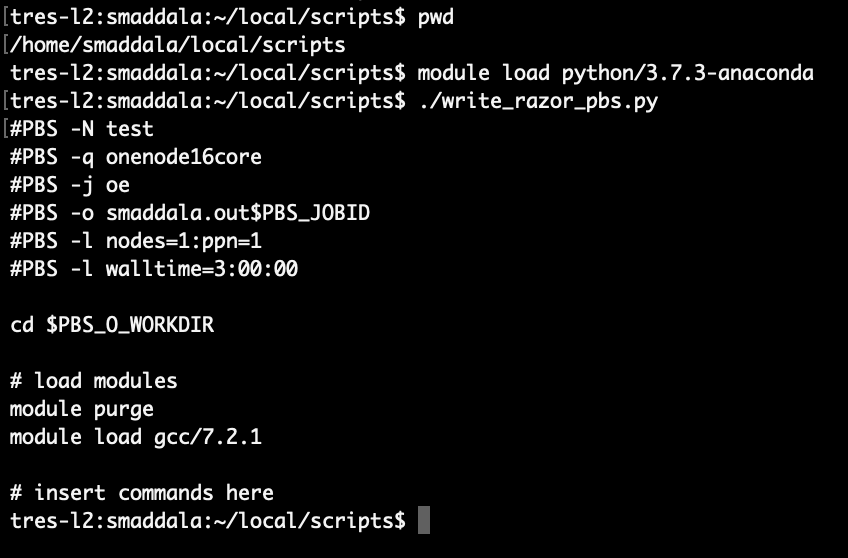

# BIOL5153

## Assignment files for the BIOL 5153 class instructed by Dr. Alverson (Spring 2021)

### Contents:
#### (1) Srusti's CV
#### (2) A tape archive containing BLAST searches of the nad4L gene in various databases
##### i. Excel sheet detailing the database size, bit scores, raw scores, and e-scores
##### ii. Text file explaining the relationship between the scoring of BLAST searches and database size
#### (3) PBS and slurm Python job scripts
##### i. 
